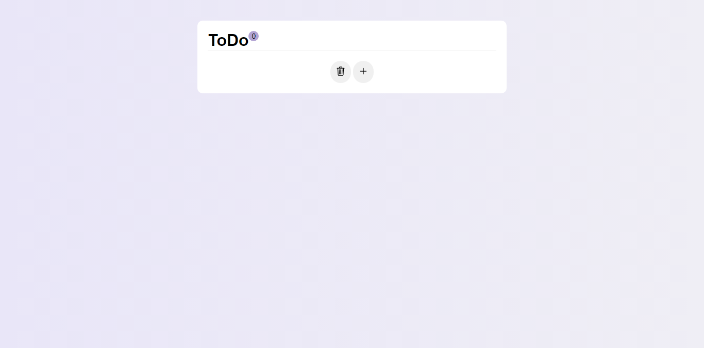
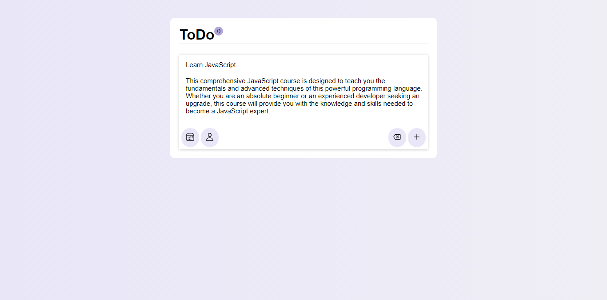
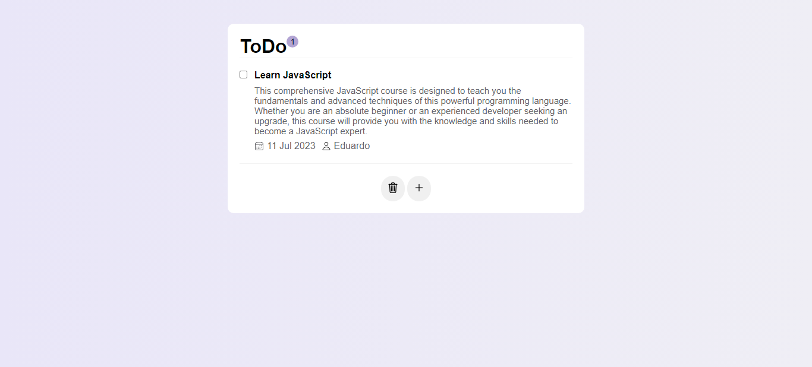

# To-Do List - HTML, CSS e JavaScript

Este repositório contém um projeto simples de uma lista de tarefas (To-Do List) desenvolvido utilizando HTML, CSS e JavaScript. O objetivo desse projeto é fornecer uma aplicação básica para treinar as habilidades em JavaScript.

## Imagens

- Inicial 

- Add nova tarefa

- Resultado

- Para mais: <a href="https://todo-eduardo.netlify.app/">Link do site</a>

## Funcionalidades

- Adicionar novas tarefas à lista
- Marcar tarefas como concluídas
- Remover tarefas da lista

## Tecnologias Utilizadas

- HTML5
- CSS3
- JavaScript

## Como Usar

1. Clone este repositório para o seu ambiente local.

2. Abra o arquivo `index.html` em um navegador da web.

3. Utilize a interface do To-Do List para adicionar, marcar como concluídas ou remover tarefas da lista.

## Contribuição

Contribuições não são aceitas neste momento, pois o projeto foi desenvolvido como um exercício para treinar habilidades em JavaScript.

 
